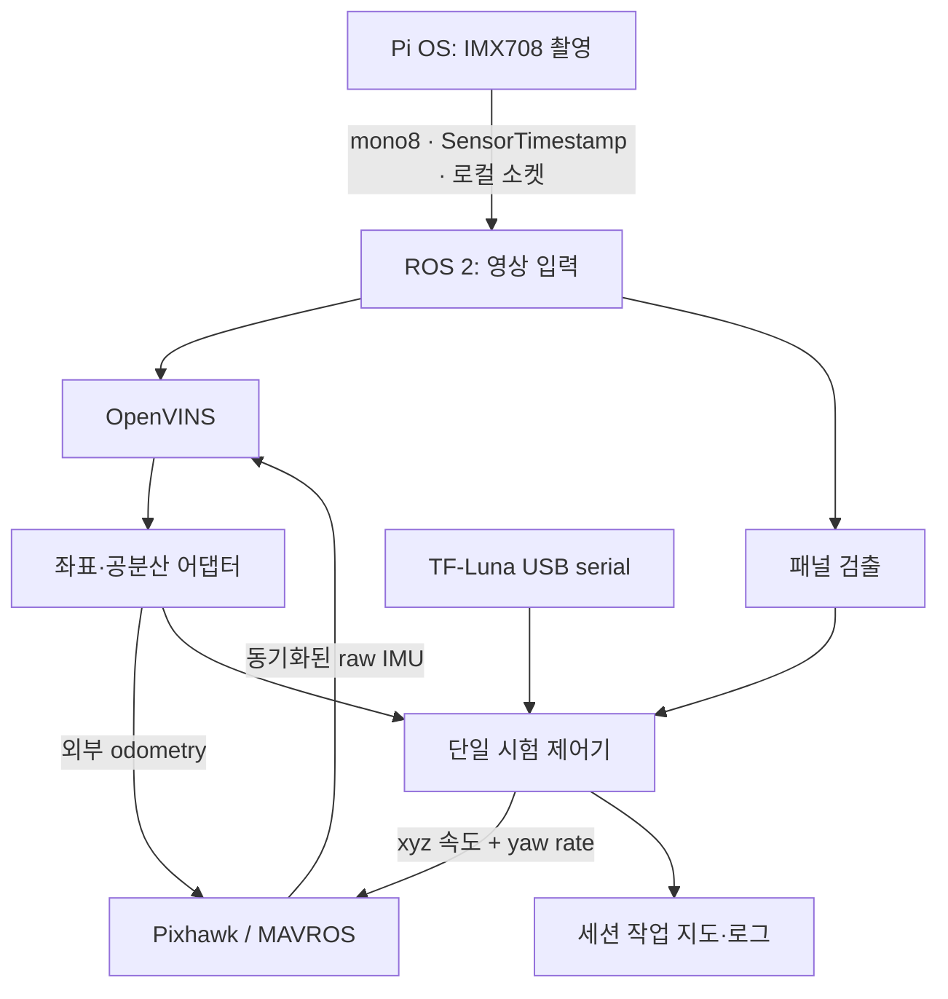

# we-meet-project — test-flying-vio

## 목적

**OpenVINS VIO + 패널 시각서보 + 작은 작업 지도로, 단일 패널에 접근해 중앙에서 5초 유지하는 시험**입니다. v2의 작업 목표를 새 구조로 구현했으며 v1/v2의 비행 코어를 가져오지 않습니다.

**라이다 기준 약 3m 이륙 → 이륙 방향으로 약 5m 앞 목표에 VIO 위치 피드백으로 접근 → 패널 발견 시 감속 → 하향 카메라 중앙의 넓은 영역에 정렬 → 연속 5초 유지 → AUTO.LAND**가 범위입니다. 패널이 일찍 보이면 5m 끝까지 전진하지 않고 정렬로 전환합니다. 패널 없이 5m에 도달하면 실패로 착륙합니다.

ArUco 표식이나 사전 환경 지도는 쓰지 않습니다. 카메라의 자연 특징점과 IMU로 이동을 추정합니다. GPS를 명령 거리의 기준으로 사용하지 않으며, 본 시험 프로필은 Pixhawk에도 외부 시각 위치·속도·yaw를 융합하도록 준비해야 합니다. **분사·물 호스 제어·오염 판단·여러 패널 순회는 이번 범위에 없습니다.** 작은 지도는 이번 세션의 패널 위치·선택 ID·5초 유지 완료 상태를 기록합니다.

**다운로드 직후 비행 가능한 기체 교정값은 포함하지 않습니다.** 실제 장착 카메라/IMU 교정, 시간 동기, LiDAR 장착 위치, PX4 융합 확인은 Pi에서 수행합니다. 미확인 값은 `null`/`false`로 남겨 시작을 차단합니다. 저장소를 내려받는 Pi Codex는 [현장 적용 순서](docs/pi_handoff.md)를 먼저 읽으세요.

## 구성과 통신



| 연결 | 메시지/경로 | 기준·목표 주기 |
|---|---|---|
| Pixhawk ↔ Pi | 기존 USB serial, 예시 `serial:///dev/ttyACM0:921600`, MAVLink 2 | MAVROS 한 인스턴스만 FC 링크 소유 |
| Pixhawk → VIO | `/mavros/imu/data_raw` → 검증 gate → `/vio/imu`, `sensor_msgs/Imu` | 목표 200Hz 이상, 실제 측정 최소 180Hz; FLU, m/s²·rad/s, 중력 포함; 원 stamp 보존 |
| Pi OS → ROS 컨테이너 | `/run/we-meet-vio/camera.sock`, Unix datagram | 640×480 mono8, 25Hz, 원본 촬영 시각 보존; JPEG/UDP 네트워크/GPU 왕복 없음 |
| 카메라 → 두 소비자 | `/camera/image_raw`, `/camera/camera_info` | 같은 픽셀·해상도·초점·교정값, 영상 회전 없음 |
| OpenVINS → 어댑터 | `/ov_msckf/odomimu`, `/ov_msckf/poseimu` | 전자는 IMU 시각의 예측, 후자는 카메라로 보정한 상태; 둘 다 신선해야 함 |
| 어댑터 → Pixhawk | `/mavros/odometry/out`, `nav_msgs/Odometry` | 최대 40Hz, pose=map/ENU, twist=base_link/FLU, 공분산·원 측정 stamp |
| 어댑터 → 시험 코드 | `/vio/body_odometry`, `/vio/status` | 이동거리는 이 위치 변화로 계산; 명령 적분으로 도착을 판단하지 않음 |
| LiDAR → 시험 코드 | `/lidar/range`, `sensor_msgs/Range` | TF-Luna 115200 baud, 목표 50Hz, 최소 20Hz; raw slant range를 한 번만 보정 |
| 시험 코드 → Pixhawk | `/mavros/setpoint_velocity/cmd_vel` | 40Hz, ENU xyz m/s + yaw rate rad/s, MAVROS `LOCAL_NED` 설정을 실제 조회 |
| 패널 검출 → 제어 | `/panels/detections`, schema 1 JSON | 8Hz, 원본 좌표·촬영 시각·4개 코너·중심·신뢰도 |

픽스호크의 자세·모터 안정화 루프는 PX4가 담당합니다. Pi는 위치/영상 오차를 제한된 속도로 바꿉니다. **영상 중앙 정렬 이후에도 VIO를 중단하지 않습니다.** 영상은 목표에 대한 XY 오차를 제공하고, VIO는 접근거리·횡방향 편차·정지 속도·좌표 연속성을 계속 확인합니다.

MAVROS를 거칠 때 ENU↔NED, FLU↔FRD 변환을 Python에서 다시 하지 않습니다. OpenVINS 출력의 IMU 기준점을 측정한 `T_body_imu`로 기체 기준점으로 옮기며 회전으로 생기는 센서 레버암 속도도 제거합니다. 이 변환을 이미 했으므로 `EKF2_EV_POS_*`는 0을 요구합니다. [좌표·시간·융합 검토](docs/integration_audit.md)에 근거와 제약을 정리했습니다.

## 동작

| 단계 | 구현 |
|---|---|
| 대기 | 기본 launch는 dry-run. `/vio_flight/start` 전에는 setpoint, mode, arming 명령 없음 |
| 시작 | disarm·착륙 상태, 센서 주기/시각/공분산, FC 추정기, 설정, 단일 명령 소유자를 확인하고 출발 위치·yaw를 한 번 저장 |
| 이륙 | 라이다 보정 높이 3m, 출발 XY 위치를 VIO로 보정, 동일 yaw 유지 |
| 안정 | 높이 ±0.12m, XY 속도 ≤0.08m/s, 수직 속도 <0.06m/s, yaw ±5°가 2초 연속 안정 |
| 접근 | VIO 위치 오차와 실제 추정 속도로 전진·횡방향 보정. 최대 0.35m/s, 가속 제한·남은 거리의 제동 한계 적용 |
| 패널 발견 | 서로 다른 영상에서 같은 지도의 패널을 3번 확인, ID 고정. 출발 기준/명령을 초기화하지 않고 1.5초에 걸쳐 제동·시각서보 혼합 |
| 정렬 | 왜곡을 제거한 중심 광선과 측정 카메라 장착 변환으로 목표 오차 계산. 최대 0.12m/s |
| 유지 | **영상 중앙 가로 30% × 세로 30%** 안에 있고 높이·yaw·실제 추정 속도가 안정된 상태를 연속 5초 유지. 조건 이탈/표적 소실 시 타이머 초기화 |
| 착륙 | AUTO.LAND 실제 모드 확인 후 setpoint 발행 중단. 착륙·disarm까지 확인해야 성공 |

패널이 잠깐 사라지면 VIO 기준 현재 위치에서 제동·대기하고, 2초 이상 같은 패널을 찾지 못하면 착륙을 요청합니다. 다른 패널로 몰래 바꾸지 않습니다. 카메라/VIO/LiDAR 중단, 과도한 공분산·yaw·속도·이탈, VIO 좌표 점프, FC/VIO 불일치도 시험을 중단합니다. RC가 모드를 바꾸면 제어권을 즉시 놓습니다. AUTO.LAND 인계가 확인되지 않으면 5초 뒤 스트림을 중단하고 FC의 준비된 Offboard-loss 처리에 넘기며 성공으로 기록하지 않습니다.

초기 시험은 **평탄한 지면에 고정된 낮은 패널(높이 0..0.10m), 하향 카메라·하향 LiDAR**에 한정합니다. 패널 높이를 `panel_height_m`에 측정해 넣습니다. 높은/기울어진 패널과 큰 지형 변화는 별도 평면 추정·고도 정책이 필요합니다. 영상 허용 영역은 미터 단위 청소 정밀도 보장이 아닙니다.

## 내려받은 Pi Codex가 해야 할 일

1. 아래 브랜치를 받고 현재 Docker/ROS·센서 장치·기존 프로세스를 조사합니다. 기존 노즐/미션 launch를 센서 확인용으로 켜지 않습니다.
2. Pi OS 호스트에서 Picamera2 촬영, ROS 컨테이너에서 같은 소켓 디렉터리를 bind mount합니다. 호스트의 Debian libcamera 바이너리를 Ubuntu 컨테이너에 복사하지 않습니다.
3. 실제 640×480·manual focus·고정 exposure/crop 설정으로 카메라 내부교정, 카메라–IMU 외부교정/시간차, IMU 노이즈, 기체·LiDAR 장착값을 준비합니다. 예전 카메라 FOV나 장착 오프셋을 이번 교정값으로 단정하지 않습니다.
4. 실제 OpenVINS를 고정 commit으로 받아 빌드합니다. `tools/configure_calibration.py`로 VIO·카메라·시각서보가 공유하는 교정 파일을 생성합니다.
5. 기본 dry-run으로 영상·VIO·LiDAR·FC 읽기와 로그를 확인하고 Pi5에서 주기·지연·CPU·온도·throttling을 측정합니다.
6. 별도 지상 확인에서 실제 PX4 버전에 맞춰 외부 시각 융합을 준비하고 실제 `cs_ev_pos/vel/yaw`를 확인합니다. 설정값 존재나 MAVLink 수신만으로 융합 성공을 선언하지 않습니다.
7. 확인값·근거·실행 경로를 보고하고, 이후 별도 비행 실행 지시를 받았을 때만 dry-run을 해제하고 start를 호출합니다.

```bash
git clone --branch test-flying-vio --single-branch https://github.com/KiHyeonLee1121/we-meet-project.git
cd we-meet-project
git status --short
git rev-parse HEAD
```

빌드·교정·FC 설정·진단·실행 명령은 [docs/pi_handoff.md](docs/pi_handoff.md)에 있습니다. `mount.example.yaml`, `capture.example.json`의 `null`은 실행값이 아닙니다. `settings.yaml`의 제어 수치는 초기 시험값이며 기체에서 검증한 튜닝값이 아닙니다. 검증 플래그를 올려서 오류를 숨기지 마세요.

## 파일

- `ros2_ws/src/we_meet_vio/`: 새 ROS 2 어댑터·제어·검출·지도 패키지
- `config/openvins.lock.json`, `tools/fetch_openvins.py`: 실제 OpenVINS 버전 고정 및 Jazzy/입력 큐 패치
- `config/openvins/estimator_config.yaml`: mono KLT, 120개 특징점, OpenCV 2 threads, ArUco 비활성화
- `tools/camera_host.py`: Pi OS 촬영 소유자; `pi_camera` ROS 노드는 로컬 수신자
- `tools/configure_calibration.py`: 측정 Kalibr 파일·장착값 변환, 추정값 생성 없음
- `tools/bench_report.py`: FC 명령 없는 토픽 주기·촬영 지연 측정
- `tools/offline_simulation.py`, `tests/`: ROS/FC 없는 회귀 시험
- `tools/smoke_ros.py`, `.github/workflows/vio-checks.yml`: 격리된 Jazzy 실제 메시지·노드 및 OpenVINS 빌드 검사

패널 검출은 우선 OpenCV 어두운 사각형 방식입니다. AI 모델로 바꿀 때는 `perception.detect()`와 검출 어댑터를 바꾸되 원본 영상 좌표·촬영 stamp·4코너·중심·신뢰도 계약을 유지합니다. VIO 입력에 모델의 resize/letterbox 영상이나 오버레이를 넣지 않습니다. [교체 계약](docs/integration_audit.md#패널-검출-교체-계약)을 참고하세요.

## 검증 범위

```bash
# ROS 없는 PC: numpy, PyYAML, OpenCV 설치 후
python3 tools/check.py
python3 tools/offline_simulation.py
```

단순 이동 모델은 비행역학/SITL이 아닙니다. 여기서 나온 수 cm 오차는 실기체 성능이 아닙니다. [검증 기록](docs/validation.md)은 코드·실제 upstream 소스 검토, 오프라인 검사와 하드웨어에서 남은 검증을 구분합니다.

Pi5 실기체 속도·영상 추적 품질·외부 추정 융합·실제 착륙은 이 작업 환경에서 측정하지 못했습니다. IMX708은 rolling shutter여서 짧은 노출만으로 모든 왜곡이 해결되지는 않습니다. 교정/시간 동기를 맞춰도 손이동 벤치에서 VIO가 불안정하면 시험을 시작하지 않고 영상 조건·진동·IMU 스트림을 점검합니다.
